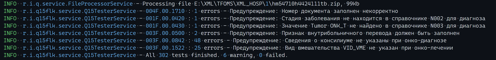

### МедКачество

Программный продукт, предназначенный для выполнения проверок форматно-логического контроля
над файлами реестров счетов медицинской помощи по правилам из нормативно-справочной информации ФФОМС.

